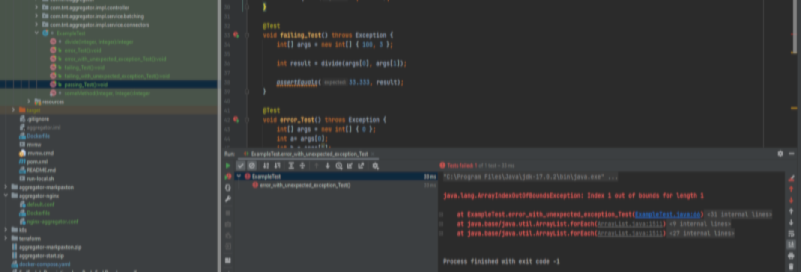
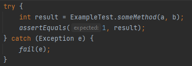
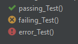
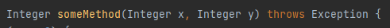
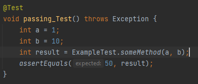
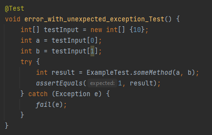

_This is a republish of [my original article from LinkedIn](https://www.linkedin.com/pulse/junit-im-stranger-failure-mark-paxton/) to make it more accessible._

# JUnit: I'm no stranger to failure...

I recently had a code review where the following test pattern was perceived negatively. I’d like to put it up for discussion and understand other viewpoints.

Why did I do this? JUnit has three test result types: pass, fail, and error:

The error state indicates your test did not pass or fail; your test method crashed in some way. This is different to fail when the test executed successfully but your code did not pass.

When your method to test has a signature like this:

Do you really want your test methods like this:

I think the "throws Exception" looks untidy, but more importantly, when someMethod does in fact throw an exception, the test returns “error” and not “fail”; it’s semantically wrong.

Leave the error state for when you really mess up your test code:

Here an ArrayIndexOutOfBoundsException is thrown because I (purposefully) messed up the code and it’s a real error in the way I prepare my test execution, so the test never 'tests'. Otherwise, when testing correctly I catch exceptions from someMethod and fail the test. The test method signature is clean.

Here’s some reading… I’d like to understand the counterarguments. Anyone? 

Contribute on the original thread on my [LinkedIn article](https://www.linkedin.com/pulse/junit-im-stranger-failure-mark-paxton/).

* ### [The Difference Between Failure and Error in JUnit | Baeldung](https://www.baeldung.com/junit-failure-vs-error)

* ### [Is it against best practice to throw Exception on most JUnit tests? | Stackoverflow](https://stackoverflow.com/questions/2496525/is-it-against-best-practice-to-throw-exception-on-most-junit-tests)
