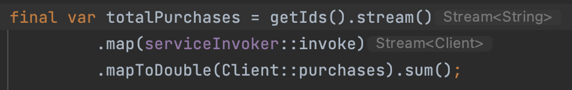

_This is a republish of [my article on LinkedIn](https://www.linkedin.com/pulse/pulling-thread-mark-paxton/) to make it more accessible._
# Pulling on a Thread

Way back in 2015 [Xavier Padró](https://www.linkedin.com/in/xavierpadro) published a [very clear and concise article](https://xpadro.com/2015/03/improving-performance-non-blocking-processing-of-streams.html) describing various ways to handle multiple blocking IO operations using Java8 streams and CompletableFuture.

In brief, the demonstration app called 20 HTTP requests, each with a 2s response time, i.e. each HTTP call blocks for 2 seconds before returning. This was done sequentially, then concurrently using three different techniques, with outcomes as below:

## 1. Sequential Stream approach:


Time taken: 42,284ms (42 seconds!)

## 2. Parallel Stream approach


Time taken: 6336ms (6 seconds!)

3. CompletableFuture (with 100 threads) approach:


Time taken: 2192ms (2seconds!)

## So, the tradeoffs:
(2) is way faster, but the concurrency is bound to the limitations of the CPU. In his demo, this was 8 cores, resulting in three rounds of HTTP calls (8,8,4) = 3*2seconds = ~6s time.

(3) Does away with the physical limitation on threads with a custom threadpool of max(100), resulting in one concurrent round of all 20 calls, resulting in ~2 seconds time.

> CompletableFuture looks like the winner, but practically there are questions. The sample doesn’t touch on error conditions, but that aside, why 100? It’s an arbitrary magic number, which needs to be chosen wisely, and managed carefully.
For details, see here.

We’ve also got a bit more code to maintain… it’s not ideal.

## Enter Reactive Programming
These were the approaches available 7 years ago, soon after java8 was released. Now things have moved on and we have Reactive Streams. Project Reactor implements this and is supported by Spring WebFlux.

There are many facets to the reactive approach, and many ways to learn about it, but for simplicity, to important aspects are:

No waiting for poll()s; messages are consumed back to back – saving time and working faster
Blocking calls are handled concurrently with built in thread management – no need to manage the ThreadPool
Backpressure slows down the data from Kafka at the transport level (TCP) so that there’s built-in rate management according to resources (and ability to scale up).
It was time to update the demonstration to include WebFlux, and here it is: github.com/MarkPaxton/flux-vs-steams

First the projects were updated to use Spring Boot and Java 17. I changed the RestTemplate to WebClient and implemented a ‘traditional’ blocking version alongside the Reactive version (here).


Then I reimplemented the processing options using the previous techniques (and a few modernising tweaks), plus the Reactive ‘Flux’ version.


## The results
* Sequential Stream | 40248ms
* Async Stream | 6033ms
* Parallel Stream | 4026ms
* CompletableFuture(100) Stream | 2261ms
* Flux | 2022ms

Sequential and CompletableFuture/100 threads perform as before.

For the parallel stream, I have 10 cores available, so it handles the 20 requests in 2 rounds of 10, resulting in 4s instead of 6 from the original article.

> I also ran a version of CompletableFuture using the default ThreadPool. I expected this to run in 4s as per parallel stream. However, it took 6s. More on this later...

WebFlux performed the best, returning slightly closer to 2s than CompletableFuture(100).

So it’s nice to see that WebFlux/Reactor uses concise code, has less configuration and runs faster.

## Back to that issue of threads
I expected my default ThreadPool version of CompletableFuture to run in 2 rounds of 10, taking 4 seconds, as per parallel stream, using all 10 cores. Instead, it ran in 3 rounds. I created a new version of my code to show me the threads each request is sent on.

It turns out that parallel stream kicks off the requests using the current thread, whereas CompleteableFuture.supplyAsync starts new threads from the pool. Since the initial thread is not included, that makes 9 threads available: 9,9,2 = 6 seconds!

See the logs below, first with parallel stream, thread ‘restartedMain’ is used in round 1 and 2:

```
INFO : restartedMain Calling C13
INFO : ForkJoinPool.commonPool-worker-5 Calling C07
INFO : ForkJoinPool.commonPool-worker-8 Calling C18
INFO : ForkJoinPool.commonPool-worker-9 Calling C11
INFO : ForkJoinPool.commonPool-worker-6 Calling C17
INFO : ForkJoinPool.commonPool-worker-3 Calling C03
INFO : ForkJoinPool.commonPool-worker-2 Calling C15
INFO : ForkJoinPool.commonPool-worker-1 Calling C02
INFO : ForkJoinPool.commonPool-worker-7 Calling C14
INFO : ForkJoinPool.commonPool-worker-4 Calling C12
INFO : ForkJoinPool.commonPool-worker-6 Calling C16
INFO : ForkJoinPool.commonPool-worker-4 Calling C20
INFO : ForkJoinPool.commonPool-worker-7 Calling C01
INFO : ForkJoinPool.commonPool-worker-8 Calling C04
INFO : ForkJoinPool.commonPool-worker-1 Calling C05
INFO : ForkJoinPool.commonPool-worker-3 Calling C06
INFO : ForkJoinPool.commonPool-worker-9 Calling C19
INFO : restartedMain Calling C09
INFO : ForkJoinPool.commonPool-worker-2 Calling C08
INFO : ForkJoinPool.commonPool-worker-5 Calling C10
INFO : restartedMain Parallel Stream | 4026ms | Total: 20.0
```

Now the default ThreadPool version of CompletableFuture, there’s no main thread, and workers-5 and worker-8 are used in round 1, 2 and 3:

```
INFO : ForkJoinPool.commonPool-worker-1 Calling C01
INFO : ForkJoinPool.commonPool-worker-2 Calling C02
INFO : ForkJoinPool.commonPool-worker-3 Calling C03
INFO : ForkJoinPool.commonPool-worker-4 Calling C04
INFO : ForkJoinPool.commonPool-worker-5 Calling C05
INFO : ForkJoinPool.commonPool-worker-6 Calling C06
INFO : ForkJoinPool.commonPool-worker-7 Calling C07
INFO : ForkJoinPool.commonPool-worker-9 Calling C09
INFO : ForkJoinPool.commonPool-worker-8 Calling C08
INFO : ForkJoinPool.commonPool-worker-9 Calling C11
INFO : ForkJoinPool.commonPool-worker-3 Calling C13
INFO : ForkJoinPool.commonPool-worker-7 Calling C15
INFO : ForkJoinPool.commonPool-worker-6 Calling C12
INFO : ForkJoinPool.commonPool-worker-8 Calling C17
INFO : ForkJoinPool.commonPool-worker-2 Calling C10
INFO : ForkJoinPool.commonPool-worker-4 Calling C14
INFO : ForkJoinPool.commonPool-worker-1 Calling C16
INFO : ForkJoinPool.commonPool-worker-5 Calling C18
INFO : ForkJoinPool.commonPool-worker-5 Calling C19
INFO : ForkJoinPool.commonPool-worker-8 Calling C20
INFO : restartedMain Async Stream | 6042ms | Total: 20.0
```
Finally, take a look at the threads using Flux:
```
INFO : restartedMain Calling C01
INFO : restartedMain Calling C02
INFO : restartedMain Calling C03
INFO : restartedMain Calling C04
INFO : restartedMain Calling C05
INFO : restartedMain Calling C06
INFO : restartedMain Calling C07
INFO : restartedMain Calling C08
INFO : restartedMain Calling C09
INFO : restartedMain Calling C10
INFO : restartedMain Calling C11
INFO : restartedMain Calling C12
INFO : restartedMain Calling C13
INFO : restartedMain Calling C14
INFO : restartedMain Calling C15
INFO : restartedMain Calling C16
INFO : restartedMain Calling C17
INFO : restartedMain Calling C18
INFO : restartedMain Calling C19
INFO : restartedMain Calling C20
INFO : restartedMain Flux | 2024ms | Total: 20.0
```
The default behaviour of a Flux is to run everything on a single thread where the subscription made. In our case the final block() call subscribes and waits for the result. Since our HTTP requests are using the non-blocking WebClient, so the main thread handles them. Here is more detail than you might ever need on the subject…

* [baeldung.com/spring-webflux-concurrency](https://www.baeldung.com/spring-webflux-concurrency)
* [spring.io/blog/2019/12/13/flight-of-the-flux-3-hopping-threads-and-schedulers](https://spring.io/blog/2019/12/13/flight-of-the-flux-3-hopping-threads-and-schedulers)

> The takeaway for this is that Reactor/WebFlux offers the opportunity for faster processing, cleaner code, thread efficiency and less complexity.

I have to be honest though, reactive programming is a new skill to master and the benefits can be marginal. It can shine in situations dominated by blocking IO, but it seems it's more a mindset you adopt, or don't. I'd really like to hear about other your own experience in choosing reactive, the challenges you faced and where you saw the big payoffs. 
