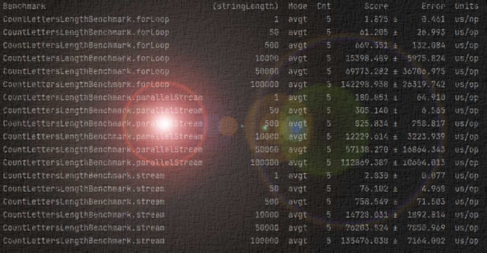
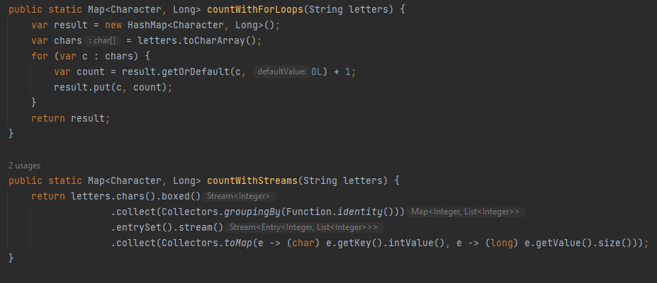
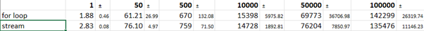
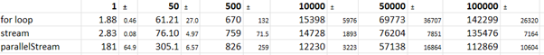
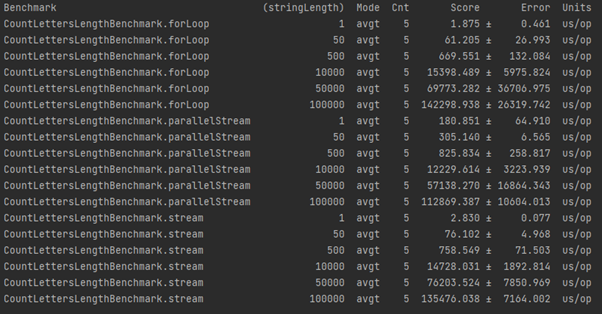

_This is a republish of [my original article from LinkedIn](https://www.linkedin.com/pulse/streams-dont-go-flow-mark-paxton) to make it more accessible._

# Streams... don't go with the flow?

I always strive to produce elegant solutions and keep on top of the latest techniques. When Java 8 steams came out it was natural to use the new streams API as much as possible. Streams offered performance advantages and looks good as well.

I was explaining the joy of using streams to a colleague, they were not so keen to learn *another* new thing just so the code would look cool. They pushed hard to justify the performance benefit. To settle the argument, we decided to do a test. Some quick tests with JUnit compared the execution time of a for-loop version and a stream version for the same method. To my surprise, traditional for-loop won!

I accepted the outcome and also changed my practice. I favour for-loops for simple tasks, anything I think a stream would be “over-the-top” for. I’ve continued to do this, but in a recent technical assessment, my ‘retro’ for-loops attracted some criticism. Why not streams here, do you not know about Streams?

So, another learning opportunity… was I wrong; how would I demonstrate my choice of method was appropriate? Deciding on “It looks over the top” is not exactly a solid engineering approach.

Hats off to [Ties van de Ven](https://blog.jdriven.com/2019/10/loop/) who captures the essence of this. He makes a clear argument that ‘looks pretty’ actually represents more maintainable and scalable code, a tangible technical benefit (at the cost of learning streams the first time). Streams 1, loops nil. But the point on performance remains; his short version:

>___“if you have a small list; for loops perform better, if you have a huge list; a parallel stream will perform better. And since parallel streams have quite a bit of overhead, it is not advised to use these unless you are sure it is worth the overhead. So although the difference is not that big, for loops win by pure performance.”___ 
 
It’s nice, but I want to apply some numbers to this. What’s a _“small list”_? What’s a _“huge list”_? What about non-parallel streams? I wanted to test this. . [Angelika Langar’s article](https://devm.io/java/java-performance-tutorial-how-fast-are-the-java-8-streams-118830) helped me get started, understanding the mechanics of performance in Java, and the importance of a proper benchmark setup. It made my JUnit competition seem laughably naïve. I got up to speed with JMH, a Java Microbenchmarking Harness to make some tests.

## The Question

> __How big must a list be to realise performance benefits from using streams?__
 
## A Test Problem

> __Given a string of arbitrary length, return the count of each character in the string. For example; “door” `{ d:1, o:2, r:1 }`, “rat” `{ r:1, a:1, t:1}`__

This can be solved pretty easily with a for-loop and a stream as follows:

Then we come to the test how long should that string be, to see a performance benefit? I started with a random string of 32 chars, generated by `UUID.randomUUID() `taking the alphanumeric characters only. I tested with n=1(32 chars), then stepped up as far as n=100k (3200k chars).

## Results
The results for each list size are in microseconds, and the error margin is indicated after it.

At the lowest end, for loop is marginally quicker, but from then on the performance is equivalent (given the error margins) even up to 3200k characters. Stream starts to get the edge at the high end.

This wasn't convincing enough, so I compared parallelStream:

Now the difference becomes clearer, parallel stream becomes faster when the string length is over 320k characters (n=10k).

It gives me a ballpark for “huge” (hundreds of thousands), a lower end for “not worth it” (a few thousand) and “optional”: anything in between.

## So this is what I’ve learned...
* ### For trivial loops (10s of iterations), don’t bother with a stream
* ### For most other things, use a stream if it adds to readability, maintainability, or it’s just easier for you to write.
* ### For large data >100k, make sure it’s a parallel stream (and probably measure performance yourself)

## ...and the limitations...

The results are limited by the test problem I used counting character occurrences. The complexity of the problem is another factor to consider. [Daniel Strmecki](https://www.baeldung.com/java-when-to-use-parallel-stream) helps me here and introduces the NQ Model. Essentially the number of elements, multiplied by the complexity of computation. It’s also a nice check against my findings, he mentions memory caching and sequential access as factors in favour of non-parallel solutions, so where he cites 10k as a reasonable N for a trivial problem, I can understand that my Q is sufficiently small that this can easily be a factor of 10 out.

### My final thought on this brings me full circle; if you’re being tested, use a stream somewhere, just for show. Regardless of the performance, you being tested, not your code!

___My benchmark code can be found on [my GitHub](https://github.com/MarkPaxton/benchmark), and the raw results below. As always, happy for your contributions and comments on [the original article](https://www.linkedin.com/pulse/streams-dont-go-flow-mark-paxton).___

